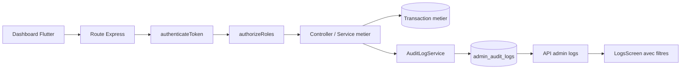

# Actions administrateur et systeme d'audit

> Document de reference pour inventorier les actions realisables depuis le dashboard admin et definir une architecture de journalisation fiable.
>
> Etat de l'analyse : 2026-09-20. Les actions marquees `Confirmee` sont retrouvees dans le code inspecte. Les actions marquees `A verifier` existent cote frontend ou dans un service, mais leur route backend ou leur autorisation doit etre verifiee avant implementation.

## 1. Objectif

Le systeme doit permettre de repondre rapidement a ces questions :

- Quel administrateur a fait quoi ?
- Sur quelle ressource et quel enregistrement ?
- Quand, depuis quelle adresse IP et quel client ?
- Quelle etait la valeur avant et apres l'action ?
- L'action a-t-elle reussi ou echoue ?
- Pourquoi l'action a-t-elle ete effectuee, lorsque l'operation est sensible ?
- Quelles actions ont ete effectuees par un admin, sur une ressource, pendant une periode donnee ?

La journalisation doit etre faite cote backend, au moment ou l'operation est autorisee et executee. Le frontend peut afficher et filtrer les journaux, mais ne doit jamais etre la source de verite d'un audit.

## 2. Constat actuel

### Elements deja presents

- Le JWT permet d'identifier l'acteur avec `req.user.id` et `req.user.role` dans `backend/src/middleware/auth.middleware.ts`.
- `user_activity_logs` existe dans `backend/prisma/schema.prisma`, avec `userId`, `action`, `details`, `ip_address`, `user_agent` et `created_at`.
- `client_manager_activity_logs` existe pour les actions d'affectation client-agent.
- `order_pricing.updated_by` conserve deja l'admin qui a modifie le prix manuel d'une commande.
- Le dashboard possede un ecran Logs, un `LogController` et un `LogService`.

### Lacunes importantes

- Le frontend appelle `/admin/logs` et `/admin/logs/export`, mais ces routes n'ont pas ete retrouvees dans les routes backend inspectees.
- Les logs existants sont disperses par domaine et ne forment pas une timeline admin unifiee.
- `user_activity_logs` represente surtout l'activite d'un utilisateur. Il ne definit pas clairement l'identite de l'admin ayant initie une action sur un autre utilisateur.
- Les informations d'avant/apres, la ressource cible, le resultat de la requete et la raison ne sont pas uniformes.
- Certaines actions frontend appellent des routes qui ne correspondent pas clairement aux routes backend presentes. Ces actions doivent etre verifiees avant de les declarer definitivement supportees.
- Les `console.log` ne remplacent pas un audit persistant : ils sont difficiles a rechercher, peuvent disparaitre, et ne garantissent pas l'integrite historique.

## 3. Inventaire des actions administrateur

### Legende de criticite

- **Critique** : acces, permissions, suppression, argent ou donnees sensibles.
- **Elevee** : modification metier ayant un impact client, financier ou operationnel.
- **Moyenne** : modification reversible ou configuration metier.
- **Faible** : consultation, recherche, filtre ou export non destructif.

### 3.1 Authentification et comptes admin

| Action | Domaine | Criticite | Etat | Donnees a conserver |
|---|---|---:|---|---|
| Connexion admin | AUTH | Elevee | Confirmee | resultat, role, IP, user-agent, raison d'echec sans stocker le token |
| Deconnexion / invalidation session | AUTH | Moyenne | Confirmee | admin, session ou token hash, date |
| Creation d'un admin | ADMIN_ACCOUNT | Critique | Confirmee | cible, role, email masque, resultat |
| Modification du compte ou du role d'un utilisateur | ADMIN_ACCOUNT | Critique | Confirmee | avant/apres, cible, champs modifies |
| Reset du mot de passe d'un utilisateur | ADMIN_ACCOUNT | Critique | Confirmee | cible, resultat, jamais le mot de passe |
| Suppression d'un utilisateur | ADMIN_ACCOUNT | Critique | Confirmee | cible, snapshot minimal, raison, resultat |
| Modification de son profil | ADMIN_ACCOUNT | Elevee | Confirmee | champs avant/apres |
| Modification de son mot de passe | AUTH | Critique | Confirmee | resultat uniquement, jamais le secret |
| Upload d'image de profil | ADMIN_ACCOUNT | Faible | Confirmee | cible, nom/type de fichier, resultat |

Routes principales : `backend/src/routes/auth.routes.ts`, `frontend/mobile/admin-dashboard/lib/services/auth_service.dart` et `user_service.dart`.

### 3.2 Utilisateurs et donnees personnelles

| Action | Domaine | Criticite | Etat |
|---|---|---:|---|
| Lister, rechercher, filtrer un utilisateur | USER | Faible | Confirmee |
| Consulter le detail, les adresses et les statistiques | USER_READ | Moyenne | Confirmee |
| Creer un client | USER | Elevee | Confirmee |
| Modifier nom, email, telephone ou role | USER | Critique | Confirmee |
| Activer ou desactiver un utilisateur | USER | Elevee | Confirmee ou route a verifier |
| Supprimer un utilisateur | USER | Critique | Confirmee |
| Exporter les utilisateurs en CSV | DATA_EXPORT | Elevee | Confirmee, export local |
| Modifier une adresse | PERSONAL_DATA | Elevee | Confirmee |

L'export utilisateur contient des donnees personnelles, des roles, des points de fidelite et des soldes affiliés : il doit etre audite comme un acces de donnees, meme s'il ne passe pas actuellement par le backend.

A verifier : le frontend appelle des routes `PATCH /api/users/:id/role` et `PATCH /api/users/:id/status`, alors que la route backend inspectee expose surtout `PUT /api/users/:id`.

### 3.3 Commandes

| Action | Domaine | Criticite |
|---|---|---:|
| Consulter, rechercher, filtrer, trier les commandes | ORDER_READ | Faible |
| Consulter le detail ou la facture | ORDER_READ | Moyenne |
| Consulter les commandes sur la carte | ORDER_READ | Faible |
| Creer une commande pour un client | ORDER | Elevee |
| Creer une commande standard | ORDER | Elevee |
| Creer une commande flash | ORDER | Elevee |
| Terminer ou convertir une commande flash | ORDER | Elevee |
| Modifier le statut | ORDER_STATUS | Elevee |
| Modifier l'adresse | ORDER_ADDRESS | Elevee |
| Modifier les champs de commande | ORDER | Elevee |
| Ajouter, modifier ou supprimer un article de commande | ORDER_ITEM | Elevee |
| Modifier le prix manuel | ORDER_PRICING | Critique |
| Supprimer le prix manuel | ORDER_PRICING | Critique |
| Marquer payee / non payee | PAYMENT | Critique |
| Modifier l'affiliation ou les dates | ORDER | Elevee |
| Affecter une commande a un livreur | DELIVERY | Elevee |
| Forcer le statut d'une commande | DELIVERY | Critique |
| Archiver une commande | ORDER | Elevee |
| Supprimer une commande | ORDER_DELETE | Critique |

Routes principales : `backend/src/routes/order.routes.ts`, `orderItem.routes.ts`, `orderPricing.routes.ts`, `archive.routes.ts`, `admin.routes.ts` et les services frontend correspondants.

Pour les commandes, le journal doit conserver au minimum : `orderId`, type flash ou standard, client concerne, ancien et nouveau statut, ancien et nouveau montant, ancien et nouvelle adresse sous forme de reference, article et quantite modifies, raison, admin et resultat.

### 3.4 Services, types, articles et prix

| Action | Domaine | Criticite |
|---|---|---:|
| Creer, modifier ou supprimer un service | CATALOG | Elevee |
| Creer, modifier ou supprimer un type de service | CATALOG | Elevee |
| Modifier la regle de poids d'un type | PRICING_CONFIG | Elevee |
| Creer, modifier, archiver ou supprimer un article | CATALOG | Elevee |
| Creer, modifier ou supprimer une categorie | CATALOG | Moyenne |
| Creer, modifier ou supprimer un prix article-service | PRICING_CONFIG | Critique |
| Modifier les associations article-service | CATALOG | Elevee |
| Creer, modifier ou supprimer une grille de prix au poids | PRICING_CONFIG | Critique |
| Consulter l'historique des prix | PRICING_READ | Faible |

Routes : `service.routes.ts`, `serviceType.routes.ts`, `article.routes.ts`, `articleCategory.routes.ts`, `articleService.routes.ts`, `pricing.routes.ts` et `weightPricing.routes.ts`.

Une modification tarifaire doit inclure les valeurs avant/apres, l'unite, la ressource concernee et une raison obligatoire pour les changements critiques.

### 3.5 Affiliates et retraits

| Action | Domaine | Criticite |
|---|---|---:|
| Consulter les affiliates, commissions, referrals et retraits | AFFILIATE_READ | Moyenne |
| Approuver un retrait | WITHDRAWAL | Critique |
| Rejeter un retrait avec une raison | WITHDRAWAL | Critique |
| Activer, suspendre ou modifier un affiliate | AFFILIATE | Elevee |
| Creer, modifier ou supprimer une liaison affiliate-client | AFFILIATE_LINK | Elevee |
| Modifier la configuration de commission | COMMISSION_CONFIG | Critique |
| Creer un client avec un code affiliate | USER | Elevee |

Les decisions de retrait et de commission doivent etre journalisees avec le montant, la devise, l'ancien et le nouvel etat, la raison et la reference du retrait.

### 3.6 Fidelite et recompenses

| Action | Domaine | Criticite |
|---|---|---:|
| Consulter solde, transactions et historique | LOYALTY_READ | Moyenne |
| Ajouter ou retirer manuellement des points | LOYALTY | Critique |
| Creer, modifier ou supprimer une recompense | LOYALTY_CONFIG | Elevee |
| Approuver ou rejeter une demande | LOYALTY_CLAIM | Elevee |
| Marquer une recompense comme utilisee | LOYALTY_CLAIM | Elevee |

Pour les points : enregistrer solde avant, delta, solde apres, raison, reference et cible. Une operation manuelle sans raison ne devrait pas etre acceptee.

### 3.7 Offres et abonnements

| Action | Domaine | Criticite |
|---|---|---:|
| Creer, modifier ou supprimer une offre | OFFER | Elevee |
| Activer ou desactiver une offre | OFFER | Elevee |
| Consulter les abonnes | SUBSCRIPTION_READ | Moyenne |
| Creer un plan d'abonnement | SUBSCRIPTION_CONFIG | Elevee |

### 3.8 Livraison et responsables clients

| Action | Domaine | Criticite |
|---|---|---:|
| Creer ou modifier un livreur | DELIVERY_ACCOUNT | Critique |
| Activer, desactiver ou supprimer un livreur | DELIVERY_ACCOUNT | Critique |
| Reset du mot de passe d'un livreur | DELIVERY_ACCOUNT | Critique |
| Affecter une commande a un livreur | DELIVERY | Elevee |
| Consulter ou modifier les clients d'un responsable | CLIENT_MANAGER | Moyenne |
| Affecter ou retirer un client d'un responsable | CLIENT_ASSIGNMENT | Elevee |
| Modifier les notes d'un client | CLIENT_DATA | Elevee |

`client_manager_activity_logs` enregistre deja `ASSIGNED`, `UNASSIGNED` et `NOTES_UPDATED`, mais l'admin initiateur doit etre ajoute a la trace unifiee.

Les actions de gestion des livreurs sont confirmees par le frontend, mais le mapping exact de toutes les routes backend reste a verifier.

### 3.9 Notifications, contenu, parametres et rapports

| Action | Domaine | Criticite |
|---|---|---:|
| Lire, marquer comme lu ou supprimer une notification | NOTIFICATION | Faible a moyenne |
| Nettoyer les notifications d'un utilisateur | NOTIFICATION_CLEANUP | Elevee |
| Creer, modifier, publier ou supprimer un article de blog | CONTENT | Elevee |
| Generer ou mettre en file un contenu | CONTENT_GENERATION | Moyenne |
| Modifier le statut de publication | CONTENT | Elevee |
| Modifier les parametres systeme | SYSTEM_CONFIG | Critique |
| Modifier les commissions ou la configuration globale | SYSTEM_CONFIG | Critique |
| Generer ou exporter un rapport | DATA_EXPORT | Elevee |
| Exporter les journaux | AUDIT_EXPORT | Critique |

Les exports doivent enregistrer le filtre utilise, le nombre de lignes, les colonnes exportees et l'admin demandeur. Ne jamais mettre de secrets ou de tokens dans les details.

## 4. Modele d'evenement recommande

Creer un modele unique, par exemple `admin_audit_logs`, plutot que de creer une table par domaine.

```text
admin_audit_logs
- id                 UUID / identifiant immutable
- occurred_at        timestamptz, serveur, indexe
- actor_user_id      UUID nullable si action systeme
- actor_role         ADMIN | SUPER_ADMIN | SYSTEM
- action             enum ou code stable, ex: ORDER.STATUS_CHANGED
- category           AUTH | ORDER | USER | PRICING | LOYALTY | ...
- severity           INFO | WARNING | HIGH | CRITICAL
- outcome            SUCCESS | FAILURE | DENIED
- target_type        ORDER | USER | ARTICLE | ...
- target_id          UUID nullable
- target_label       texte masque ou libelle court optionnel
- request_id         UUID pour relier tous les logs d'une requete
- ip_address         inet ou texte
- user_agent         texte tronque
- route              texte
- http_method        texte
- reason             texte nullable
- before_data        JSON nullable, champs metier uniquement
- after_data         JSON nullable, champs metier uniquement
- metadata           JSON nullable, references et contexte non sensible
- error_code         texte nullable, sans stack trace ni secret
```

### Regles de donnees

1. Le timestamp vient du serveur et est toujours en UTC.
2. La ligne est immutable : aucune interface ne doit permettre de modifier ou supprimer un audit.
3. Les mots de passe, JWT, tokens, secrets de paiement et donnees inutiles ne sont jamais stockes.
4. Les donnees personnelles sont minimales et masquees dans les libelles et exports.
5. `before_data` et `after_data` contiennent uniquement les champs necessaires a expliquer le changement.
6. Les requetes de lecture ordinaires ne doivent pas creer un log pour chaque frappe ou filtre. On journalise les acces sensibles, les exports et les mutations.
7. Un refus d'autorisation est un evenement `DENIED`, meme si l'operation metier n'a pas ete executee.
8. L'absence de journalisation ne doit pas faire echouer une operation non critique, mais une operation critique doit utiliser une transaction ou une strategie de reprise clairement definie.

### Nomenclature des actions

Utiliser des codes stables et recherchables :

- `AUTH.LOGIN_SUCCEEDED`
- `AUTH.LOGIN_FAILED`
- `ADMIN.CREATED`
- `ADMIN.ROLE_CHANGED`
- `USER.CREATED`
- `USER.UPDATED`
- `USER.DELETED`
- `ORDER.CREATED`
- `ORDER.STATUS_CHANGED`
- `ORDER.ADDRESS_CHANGED`
- `ORDER.ITEM_UPDATED`
- `ORDER.PRICING_CHANGED`
- `ORDER.PAYMENT_MARKED_PAID`
- `ORDER.DELETED`
- `PRICING.CONFIG_UPDATED`
- `AFFILIATE.WITHDRAWAL_APPROVED`
- `LOYALTY.POINTS_ADJUSTED`
- `DATA.EXPORTED`
- `AUDIT.EXPORTED`
- `ACCESS.DENIED`

Les codes ne doivent pas dependre du texte francais affiche dans le dashboard.

## 5. Architecture conseillee



### 5.1 Service central

Ajouter un `AuditLogService` backend avec une API unique :

```ts
await AuditLogService.record({
  actor: req.user,
  action: 'ORDER.STATUS_CHANGED',
  category: 'ORDER',
  severity: 'HIGH',
  outcome: 'SUCCESS',
  targetType: 'ORDER',
  targetId: order.id,
  request: req,
  reason: body.reason,
  before: { status: oldStatus },
  after: { status: newStatus },
  metadata: { source: 'admin_dashboard' },
});
```

Le service doit normaliser l'acteur, extraire `request_id`, tronquer l'user-agent, masquer les champs interdits et refuser les payloads trop volumineux.

### 5.2 Placement de l'appel

- Apres une mutation reussie, dans la meme transaction Prisma que la mutation quand c'est possible.
- Dans un `catch`, enregistrer `outcome: FAILURE` avec un code d'erreur public, sans stack trace sensible.
- Dans le middleware d'autorisation, enregistrer `ACCESS.DENIED` pour les routes admin sensibles.
- Dans un middleware de requete uniquement pour les evenements transverses : login, refus, export, et erreurs inattendues. Le middleware ne connait pas toujours le before/after, donc il ne remplace pas l'appel metier.

### 5.3 Transaction et fiabilite

Pour un changement de prix, de points, de paiement, de retrait ou de permissions :

```text
transaction Prisma
  1. lire la valeur avant
  2. appliquer la mutation
  3. creer admin_audit_logs avec before/after
  4. commit
```

Pour les journaux de login echoue ou de refus, une ecriture separee suffit. Pour les actions tres frequentes, une file durable peut etre utilisee plus tard, mais elle ne doit pas etre la premiere version si elle complique la garantie d'ecriture.

## 6. API de consultation

Proposer une route admin dediee, par exemple :

- `GET /api/admin/audit-logs`
- `GET /api/admin/audit-logs/:id`
- `GET /api/admin/audit-logs/export`

Filtres recommandes :

- `actorUserId`
- `actorRole`
- `action`
- `category`
- `severity`
- `outcome`
- `targetType`
- `targetId`
- `startDate`, `endDate`
- `requestId`
- `page`, `limit`
- `sort=occurredAt`, `order=desc`

Autorisation recommandee :

- `SUPER_ADMIN` : consulter, exporter, voir les details sensibles autorises.
- `ADMIN` : consulter les journaux operationnels selon une politique explicite.
- Aucun admin ne peut supprimer ou modifier les audits.
- Les details `before_data` et `after_data` peuvent etre masques selon le role.

Indexes minimaux :

- `(occurred_at DESC)`
- `(actor_user_id, occurred_at DESC)`
- `(action, occurred_at DESC)`
- `(category, occurred_at DESC)`
- `(target_type, target_id, occurred_at DESC)`
- `(outcome, occurred_at DESC)`

Le frontend Logs actuel devra ensuite remplacer les filtres limites `CREATE / UPDATE / DELETE` par des filtres category, action, acteur, cible, resultat et periode. L'export devra recevoir un vrai fichier ou un flux HTTP, pas seulement effectuer un `GET` sans traiter le contenu.

## 7. Plan d'implementation par phases

### Phase 1 : socle backend

1. Ajouter le modele Prisma `admin_audit_logs` et les indexes.
2. Ajouter `AuditLogService` et les constantes d'actions.
3. Enrichir le contexte de requete avec un `request_id` et extraire IP/user-agent.
4. Ajouter les routes de consultation protegees.
5. Ajouter les tests du service : masquage, acteur, dates, resultat, pagination et autorisation.

### Phase 2 : actions critiques

Instrumenter en premier :

1. login reussi, login echoue, refus d'acces et logout ;
2. creation/modification/suppression admin et reset mot de passe ;
3. creation, suppression et statut commande ;
4. prix manuel, paiement, articles et adresse commande ;
5. ajustement de points ;
6. approbation/rejet de retrait ;
7. modifications tarifaires ;
8. exports de donnees ;
9. nettoyage de notifications et parametres systeme.

### Phase 3 : couverture metier

Ajouter les services, articles, categories, offres, abonnements, blog, livraison, affectations de clients et liaisons affiliates.

### Phase 4 : interface de recherche

1. Remplacer le faux endpoint `/admin/logs` par `/admin/audit-logs` ou implementer un alias temporaire.
2. Ajouter pagination serveur et tri.
3. Ajouter recherche par admin, action, categorie, ressource, resultat et periode.
4. Afficher le detail avant/apres dans un dialogue protege.
5. Ajouter l'export filtre et auditer l'export lui-meme.

### Phase 5 : durcissement

- Retention documentee, par exemple 12 a 24 mois selon les contraintes metier.
- Acces en lecture trace dans l'audit.
- Alertes sur suppressions, changements de role, prix, paiements et retraits.
- Verification periodique des routes admin non instrumentees.
- Tests d'integration garantissant qu'une mutation critique cree un evenement.

## 8. Matrice de priorite

| Priorite | Actions |
|---|---|
| P0 | role/password/admin, suppression, paiement, prix manuel, points, retraits, exports, refus d'acces |
| P1 | statut/adresse/articles commande, creation commande, tarifs, affiliates, livraison, affectations clients |
| P2 | catalogue, offres, abonnements, blog, notifications, configuration non critique |
| P3 | consultations ordinaires, filtres, statistiques et navigation |

## 9. Tests indispensables

### Tests unitaires

- Le service ajoute toujours `actor_user_id`, `actor_role` et `occurred_at` serveur.
- Les secrets et champs interdits sont masques.
- Les payloads `before`/`after` sont limites et serialisables.
- Les filtres et indexes sont traduits correctement en requete Prisma.
- Un admin non autorise ne peut pas consulter ou exporter les audits.

### Tests d'integration

- Une modification de statut commande cree un evenement avec le bon ancien et nouveau statut.
- Un paiement marque paye cree un evenement critique.
- Une modification de prix cree un evenement dans la meme transaction.
- Une suppression cree un snapshot minimal avant suppression.
- Une erreur metier cree un evenement `FAILURE` si la politique de la route le demande.
- Une reponse 403 sur une route sensible cree un evenement `ACCESS.DENIED`.

### Tests de bout en bout

- Recherche par admin et par periode.
- Recherche par commande ou utilisateur cible.
- Export avec filtres.
- Consultation du detail sans exposer de secret.
- Pagination stable quand plusieurs admins ecrivent en meme temps.

## 10. Decisions recommandees

1. Utiliser une table centrale `admin_audit_logs` pour la recherche transverse.
2. Garder les tables metier existantes comme donnees specialisees, mais faire pointer la timeline admin vers le modele central.
3. Journaliser cote backend, jamais uniquement dans Flutter.
4. Capturer `before` et `after` seulement pour les mutations sensibles.
5. Utiliser des codes d'action stables et une categorie normalisee.
6. Rendre les logs append-only et supprimer toute route de suppression.
7. Commencer par les actions P0 et P1, puis couvrir les autres domaines.
8. Ajouter les logs dans les transactions critiques afin d'eviter un audit qui declare une action non appliquee ou l'inverse.
9. Ne pas journaliser chaque lecture ordinaire : journaliser les exports et les consultations de donnees tres sensibles.
10. Corriger ou verifier les routes frontend/backend divergentes avant de declarer une action comme supportee.

## 11. Prochaine etape recommandee

La prochaine implementation peut etre decoupee en un premier lot limite et testable :

1. schema Prisma `admin_audit_logs` ;
2. `AuditLogService` ;
3. audit de `ORDER.STATUS_CHANGED`, `ORDER.PRICING_CHANGED`, `ORDER.PAYMENT_MARKED_PAID`, `ADMIN.ROLE_CHANGED` et `DATA.EXPORTED` ;
4. `GET /api/admin/audit-logs` avec filtres periode, acteur, action et cible ;
5. adaptation de l'ecran Logs existant ;
6. tests d'integration sur ces cinq actions.

Ce lot donne rapidement une vraie tracabilite sur les operations les plus sensibles, sans devoir instrumenter tout le dashboard en une seule iteration.
